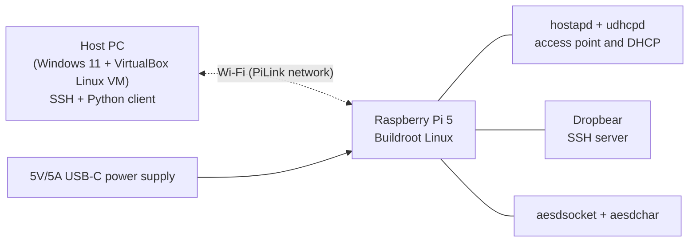

# Project Overview: PiLink

## Overview

PiLink turns a Raspberry Pi 5 into a self-hosted wireless access point. At power-on, the Pi starts its own Wi-Fi network, hands out addresses to connecting devices, and accepts SSH logins, so a PC can connect and work with it without any cables or existing network. The `aesdsocket` server and `aesdchar` driver from earlier assignments run over this link, with a Python client on the PC. The motivation is to learn how headless embedded Linux devices are reached and configured in the field, a pattern used by IoT setup modes and portable appliances.

## Build System

Buildroot, based on `raspberrypi5_defconfig`.

## Hardware Platform

Raspberry Pi 5 ([Buildroot board support](https://github.com/buildroot/buildroot/tree/master/board/raspberrypi)) with its onboard Wi-Fi and a 5V/5A USB-C power supply. The host is a Windows PC with a Wi-Fi adapter.

## Open Source Projects

- [Buildroot](https://buildroot.org)
- [Raspberry Pi Linux kernel](https://github.com/raspberrypi/linux) (brcmfmac Wi-Fi driver)
- [hostapd](https://w1.fi/hostapd/) (access point)
- [BusyBox](https://busybox.net) (`udhcpd` DHCP server)
- [Dropbear](https://matt.ucc.asn.au/dropbear/dropbear.html) (SSH)
- [linux-firmware](https://git.kernel.org/pub/scm/linux/kernel/git/firmware/linux-firmware.git) and [wireless-regdb](https://git.kernel.org/pub/scm/linux/kernel/git/wens/wireless-regdb.git) (Wi-Fi firmware and regulatory data)

## Previous Assignment Content

- `aesdsocket` (Assignments 5–6), extended to serve over the wireless interface
- `aesd-char-driver` (Assignments 8–9), used as the on-target log store
- Buildroot external tree (Assignment 4), adapted for the Pi 5

## Course Content Covered

Buildroot packaging, kernel modules and character drivers, socket servers and daemons, and init scripts for automatic startup.

## Content Not Covered in the Course

Wireless access point mode: bringing up the Pi 5's Wi-Fi firmware and driver, running hostapd through nl80211, serving DHCP on the wireless interface, and starting the full network stack automatically at boot.

## Use With Other Courses

Not used with any other course.

## Source Code Organization

- [`<final-project-repo>`](https://github.com/<org>/<final-project-repo>): Buildroot external tree, rootfs overlay, init scripts, PC client
- [`<assignments-repo>`](https://github.com/<org>/<assignments-repo>): `aesdsocket` and `aesd-char-driver` source
- [`<projects-board-repo>`](https://github.com/<your-username>/<projects-board-repo>): GitHub Projects board

## Schedule

See the [Schedule page](<link-to-schedule-wiki-page>).# Project Overview: PiLink
